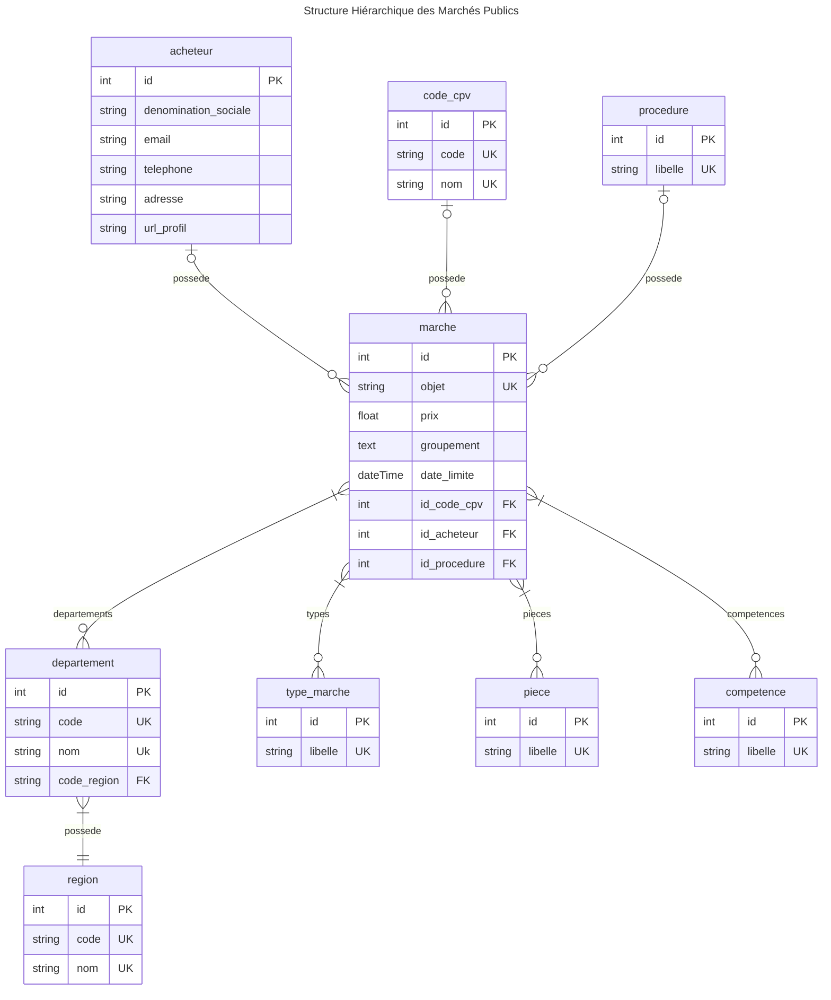

# ao-website 💼
Ce projet vise à fournir une plateforme de suivi des appels d'offres, permettant une veille efficace sur les marchés publics. Le site, offre un accès convivial et complet aux données d'appels d'offres.

## Configuration ⚙️
### Prérequis
- Docker
- Docker Compose
### Installation
1. **Cloner le dépôt :**
    ```bash
    git clone -b veille_marche https://github.com/hedi-mac/ao-website.git
    cd ao-website
2. **Lancer l'application avec Makefile :**
    ```bash
    make up
Cela construira les conteneurs et lancera l'application à l'aide de Docker Compose.

3. **Générer des marchés fictifs :**
    ```bash
    make fake-marches
Cela génère les marchés fictifs avec leurs départements, compétences, pièces et procédures respectifs.

## 📋 Documentation Utilisation API Marchés

### 🐳 Commandes Makefile principales

| Commande | Description |
|----------|-------------|
| `make up` | 🚀 Démarre les conteneurs Docker |
| `make down` | 🛑 Stoppe et supprime les conteneurs |
| `make build` | 🔨 Reconstruit les images Docker |
| `make fake-marches` | 🎭 Génère des données fictives (marchés, procédures, pièces…) |
| `make test` | 🧪 Lance les tests unitaires et d'intégration avec pytest |
| `make pre-commit-all` | ✅ Exécute tous les hooks de qualité de code (formatage, lint, sécurité) |

### 🔗 Endpoints principaux

#### 1️⃣ **GET** — Liste des marchés avec filtres 

**URL :**
``
http://localhost:8000/api/marche/
``
**Filtres disponibles :**

| Paramètre | Type | Description |
|-----------|------|-------------|
| `objet` | string | Recherche par mot-clé dans l'objet du marché |
| `prix_min` / `prix_max` | float | Plage de prix |
| `date_limite_after` / `date_limite_before` | date | Filtre par date limite |
| `competences` | int | IDs des compétences associées |
| `departements` | int | IDs des départements associés |
| `search` | string | Recherche globale dans plusieurs champs |
**Exemples :**

``
http://localhost:8000/api/marche/?search=travaux&prix_min=5000&departements=2
``

``
http://localhost:8000/api/marche/?departements=22&departements=5
``

``
http://localhost:8000/api/marche/?page=1&nb_per_page=2
``
#### 2️⃣ **POST** — Créer un marché
**URL :**
``
http://localhost:8000/api/marche/
``

**Corps JSON :**
``
{
    "objet": "Example obj",
    "prix": 99.0,
    "departement_ids": [2, 5],
    "date_limite": "2026-11-14",
    "procedure_id": 2,
    "competence_ids": [2, 3],
    "piece_ids": [5],
    "acheteur_id": 1,
    "groupement": "test groupement text"
}
``
#### 3️⃣ **PUT** — Mettre à jour un marché
**URL :**
``
http://localhost:8000/api/marche/102/
``

**Corps JSON :**
``
{
    "objet": "Example obj UPDATED",
    "prix": 99.0,
    "departement_ids": [1],
    "date_limite": "2026-05-04",
    "procedure_id": 7,
    "competence_ids": [3],
    "piece_ids": [1],
    "acheteur_id": 2,
    "groupement": "test groupement UPDATED text"
}
``
#### 4️⃣ **GET** — Récupérer un marché par ID
**URL :**
``
http://localhost:8000/api/marche/102/
``
#### 5️⃣ **DELETE** — Supprimer un marché
**URL :**
``
http://localhost:8000/api/marche/102/
``

## Conception 🧩

La conception du projet repose sur une **modélisation relationnelle** des entités clés du domaine des marchés publics, représentée par le diagramme suivant (**ERD**) :



## Structure du Projet 🗂️

La structure du projet est organisée comme suit :

```
ao-website/
├── ao_website/
│   ├── apps/
│   │   └── appelsoffres/
│   │       ├── management/
│   │       │   └── commands/
│   │       │       ├── generate_competences.py
│   │       │       ├── generate_departements.py
│   │       │       ├── generate_pieces.py
│   │       │       ├── generate_procedures.py
│   │       │       └── generate_type_marche.py
│   │       ├── migrations/
│   │       ├── tests/
│   │       ├── apps.py
│   │       ├── filters.py
│   │       ├── models.py
│   │       ├── serializers.py
│   │       ├── urls.py
│   │       ├── utils.py
│   │       └── views.py
│   ├── config/
│   │   ├── asgi.py
│   │   ├── settings.py
│   │   ├── urls.py
│   │   └── wsgi.py
│   └── manage.py
├── docker-compose.yml
├── dockerfile
├── entrypoint.sh
├── Makefile
├── requirements.txt
├── .env
├── .pre-commit-config.yaml
└── README.md
```

- **`ao-website/`**

     - **`apps/`**

        - **` appelsoffres/`** : Application principale pour les appels d'offres.

            - **`management/commands/`** : Commandes personnalisées (génération de données initiales).

            - **`migrations/`** : Fichiers de migration de la base de données.

            - **`tests/`** : Tests unitaires et d'intégration.

            **`apps.py`** : Déclaration de l'application.

            **`filters.py`** : Filtres pour les requêtes API.

            **`models.py`** : Modèles de données (Marche, Acheteur, Département, etc.).

            **`serializers.py`** : Sérialiseurs DRF.

            **`urls.py`** : Routes.

            **`utils.py`** : Fonctions utilitaires.

            **`views.py`** : Endpoints API.

    - **`config/`** : Configuration globale du projet.

        **`settings.py`** : Paramètres principaux.

         **`urls.py`** : Routage global des URLs.

**`docker-compose.yml`** : Configuration des services Docker.

**`dockerfile`** : Instructions de build Docker.

**`entrypoint.sh`** : Script de démarrage du conteneur.

**`Makefile`** : Commandes d'automatisation.

**`requirements.txt`** : Dépendances Python.

**`.env`** : Variables d'environnement.

**`.pre-commit-config.yaml`** : Configuration pre-commit.


